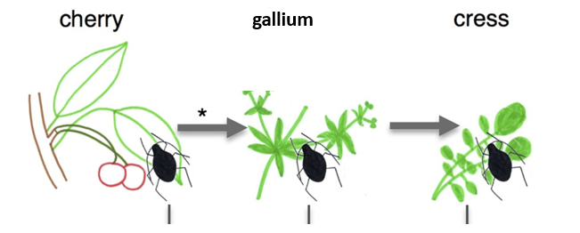

```{r include=FALSE}

knitr::opts_chunk$set(comment = NA)
error = TRUE

```


```{r, global_options, include=FALSE}
knitr::opts_chunk$set(message=FALSE, tidy.opts=list(width.cutoff=80), tidy=TRUE) 
```
## 0.1 The is a R markdown document 

These are cool as you can make a nice .pdf when you are finished. 
The run the code, highlight the line of interest and press enter. 

***

## Load the library needed

```{r}

library(edgeR)
library(knitr)

# if not installed
# install.packages("BiocManager")
# BiocManager::install("edgeR")

```
Further information for edgeR can be found [here.](https://bioconductor.org/packages/release/bioc/html/edgeR.html)

***

##  Load the data

counts were already generated using salmon and counts.matrix generated using trinity. 

```{r}
setwd("C:/Users/pjt6/Desktop/RNAseq_lecture_workshop/DE_gene/two_bio_reps")


# check it
getwd()

```
***


The counts data in contained in the counts.matrix, each gene has a digital count per
condition/ rep

```{r}
# see what is in the directory 
dir()


# load in the data
data <- read.delim("TableOfCounts.txt", header=T, row.names=1)

# group the replicas
group <- factor(c(1,1,2,2))

#Include image replica

fig.cap=paste("Figure 1")

```
\newpage

have a quick look at the data:

```{r}
head(data)

```

```{r}

# store the data in a list-based object.
rnaseqMatrix <- DGEList(counts=data, group=group)

```


```{r}

# have a little look at the data 
head(rnaseqMatrix)

```


filter very low expression genes as these do not contribute and negatively affect the stats


```{r}

keep <- filterByExpr(rnaseqMatrix)

rnaseqMatrix <- rnaseqMatrix[keep,,keep.lib.sizes=FALSE]

table(keep)


```


to account for sequencing depth, calcNormFactors finds a set of scaling facotrs for lib sizes.
this minimised the log fold change between samples for most genes
Note this is not FRPM or TPM normalisation, raw values need to be given to EdgeR, as these are
needed to estimate the mean-variance relationship between the samples

```{r}

rnaseqMatrix <- calcNormFactors(rnaseqMatrix)

```


write a table of the lib size and normalisation factors. Look at how these are different. 

```{r}

rnaseqMatrix$samples$eff.lib.size = rnaseqMatrix$samples$lib.size * rnaseqMatrix$samples$norm.factors
write.table(rnaseqMatrix$samples, file="example.matrix.TMM_info.txt", quote=F, sep="\t", row.names=F)

```


```{r}
# have a look
rnaseqMatrix$samples

```


```{r}
# group are your samples
design <- model.matrix(~group)

```


estimate the dispertion
```{r}

rnaseqMatrix <- estimateDisp(rnaseqMatrix,design)


```


run the DE analysis:


```{r}
# To perform quasi-likelihood F-tests: (better for low numbers of reps)
fit <- glmQLFit(rnaseqMatrix, design)

plotQLDisp(fit)


# value 0.01 is good for DE analysis. 
rnaseqMatrix$common.dispersion


```


```{r}

# have a little look
fit


```


```{r}

qlf <- glmQLFTest(fit,coef=2)

topTags(qlf)


tTags = topTags(qlf,n=NULL)

result_table = tTags$table
 
```


write the results to files

```{r}

result_table = data.frame(sampleA="cherry", sampleB="gallium", result_table)

result_table <- result_table[order(result_table$logFC),]

write.table(result_table, file='M.cerasi_cherry_vs_gallium.GLM.edgeR.DE_results', sep='	', quote=F, row.names=T)

write.table(rnaseqMatrix, file='M.cerasi_cherry_vs_gallium.GLM.edgeR.count_matrix', sep='	', quote=F, row.names=T)


```


plot a PCA


 
 
```

